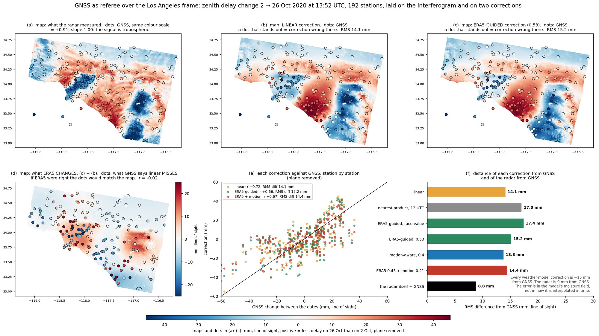
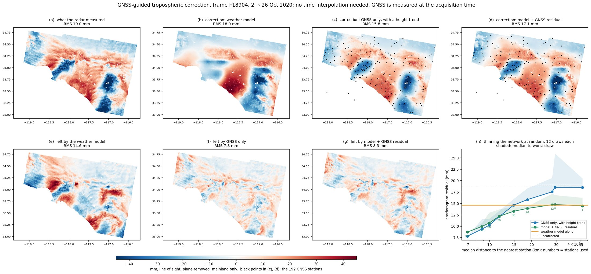
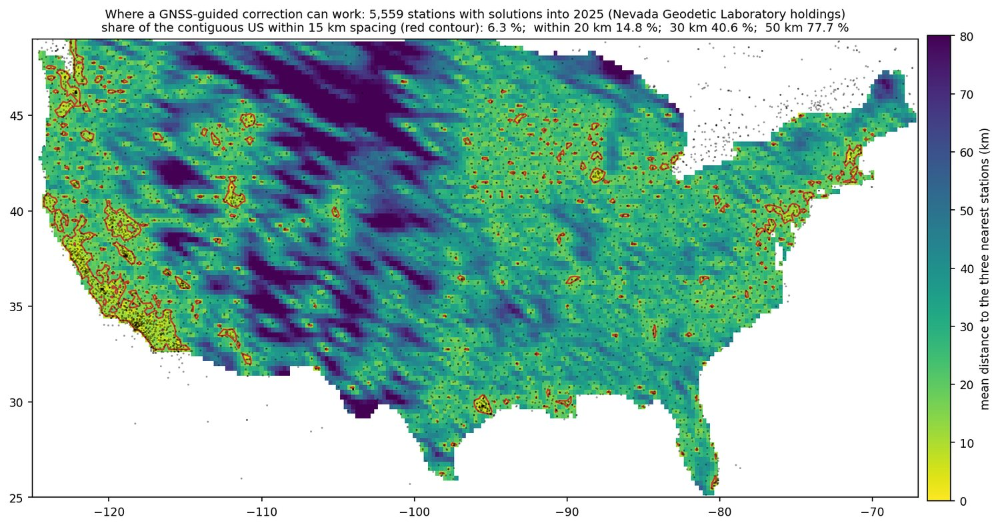

# GNSS-guided tropospheric correction

`tropo-apply` turns OPERA L4 TROPO-ZENITH cubes into a line-of-sight correction. Where a
dense GNSS network exists, the zenith delays it measures can correct what the weather
model gets wrong. This is **optional and off by default**; without it the output is
unchanged.

## Usage

```bash
# 1. GNSS zenith total delays at the acquisition times (Nevada Geodetic Laboratory, 5-minute products)
opera-utils tropo-gnss-download --aoi-bounds -119.4 32.9 -116.2 34.9 \
    --datetimes 2020-10-02T13:52:36 2020-10-26T13:52:36 --output-file gnss_ztd.csv

# 2. the usual crop and apply, with the table added
opera-utils tropo-crop --tropo-urls-file tropo_urls.txt --datetimes ... --aoi-bounds ...
opera-utils tropo-apply --cropped-tropo-list cropped_tropo/*.nc --dem-path dem.tif \
    --incidence-angle-path incidence.tif --gnss-ztd-file gnss_ztd.csv
```

```python
from opera_utils.tropo import apply_tropo, download_ngl_ztd

table = download_ngl_ztd(aoi_bounds, datetimes, output_file="gnss_ztd.csv")
apply_tropo(cropped_files, dem_path, incidence_angle_path, gnss_ztd_file=table)
```

Any GNSS source works: the table needs the columns `id, lat, lon, height, datetime, ztd`
(`ztd` in meters, one row per station and acquisition time). Each output GeoTIFF records
the number of stations used, the kriging range and nugget, and the leave-one-out error.

## Method

1. The model zenith total delay is read from the cropped cube at each station's own
   position **and height**.
2. The residual GNSS − model is differenced between a date and the reference date,
   using only stations present on both. Constant per-station biases (antenna, height
   datum) cancel. This is why the option requires `subtract_first_date=True`.
3. Residuals more than four robust standard deviations from the median are dropped,
   and the median is removed: a constant is invisible to InSAR and must not leak into
   areas without stations.
4. The residuals are interpolated with **zero-mean kriging** (exponential covariance;
   range and nugget chosen by leave-one-out at the stations). Away from stations the
   field decays to zero, so the result **falls back to the model correction**.
5. The field is added to the model zenith delay before projection to line of sight.
   With fewer than five common stations the model correction is returned as is.

GNSS is measured every few minutes, so nothing is interpolated in time.

## Evidence

One Sentinel-1 interferogram: OPERA DISP-S1 frame F18904 (Los Angeles basin),
2 → 26 October 2020, a day with a sharp Santa Ana moisture contrast. 192 stations inside
the footprint, median spacing 6.9 km.



*GNSS laid on the interferogram and on the model correction, same colour scale. The radar
and GNSS agree (r = 0.91, slope 1.00, 8.8 mm apart): the signal is tropospheric. The model
correction sits 14 mm from GNSS: right pattern, wrong detail. The error is in the model's
moisture field, which no interpolation in time can repair.*



| correction | interferogram residual | leave-one-out at stations |
|---|---:|---:|
| none | 19.1 mm | |
| weather model | 14.6 mm | 18.2 mm |
| GNSS only, with a height trend | 7.8 mm | 8.8 mm |
| **model + kriged GNSS residual (this option)** | **8.3 mm** | **8.4 mm** |

The library implementation, run end to end on this case, gives 14.65 mm without the option
and 8.26 mm with it (241 stations).

**It depends on station density.** Thinning the network at random:

| stations | spacing | GNSS only | model + GNSS residual |
|---:|---:|---:|---:|
| 192 | 7 km | 7.8 mm | 8.7 mm |
| 50 | 12 km | 12.1 | 12.2 |
| 30 | 15 km | 14.6 | 13.3 |
| 12 | 28 km | 17.5 | 14.7 |
| 5 | 46 km | 18.5 | 14.5 |

The benefit needs stations within roughly 15 km in this scene. The hybrid form is the
safe one: as the network thins it returns to the model (14.6 mm) and does no harm, whereas
GNSS alone becomes worse than the model. That is why only the hybrid is offered.



Only about 6 % of the contiguous US has its three nearest stations within 15 km on average
(15 % within 20 km, 41 % within 30 km): coastal California, the Bay Area, Puget Sound, parts
of Nevada and Utah, Houston, and scattered clusters.

## Limits

* **One scene.** Its moisture contrast was unusually sharp, so its correlation length was
  short; smoother weather may tolerate a sparser network. 15 km is a first estimate.
* GNSS zenith delay averages over a cone of sky, and the radar itself was 8.8 mm from GNSS
  at the stations, so the residuals above are near the floor of the comparison.
* Final 5-minute solutions arrive with about two weeks' latency, rapid ones the next day.
* The residual is added at every height as measured; it is not rescaled with pixel height.
* No stack has been processed with it yet.
