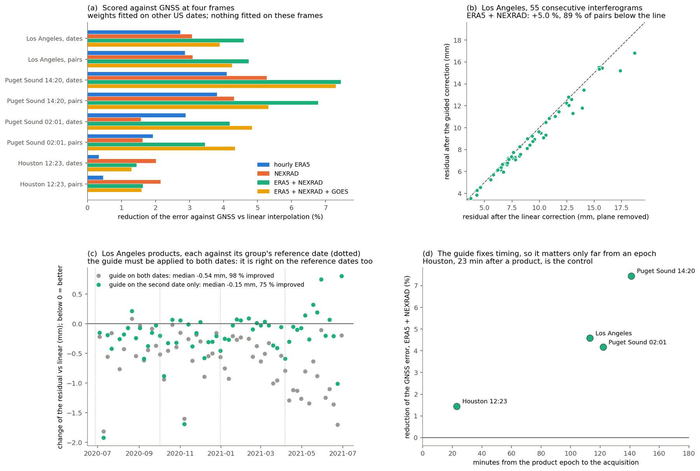
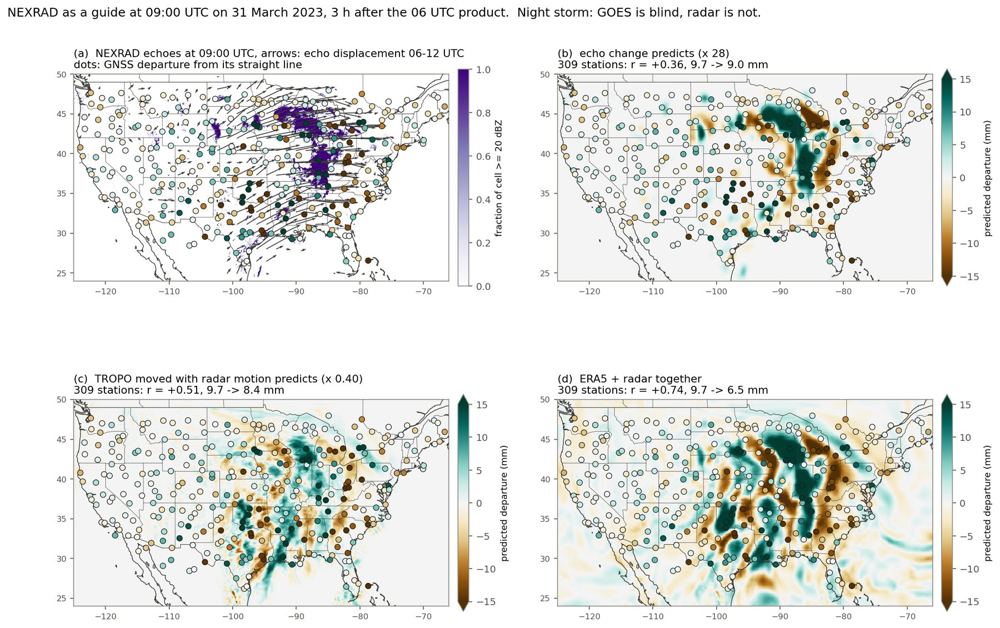
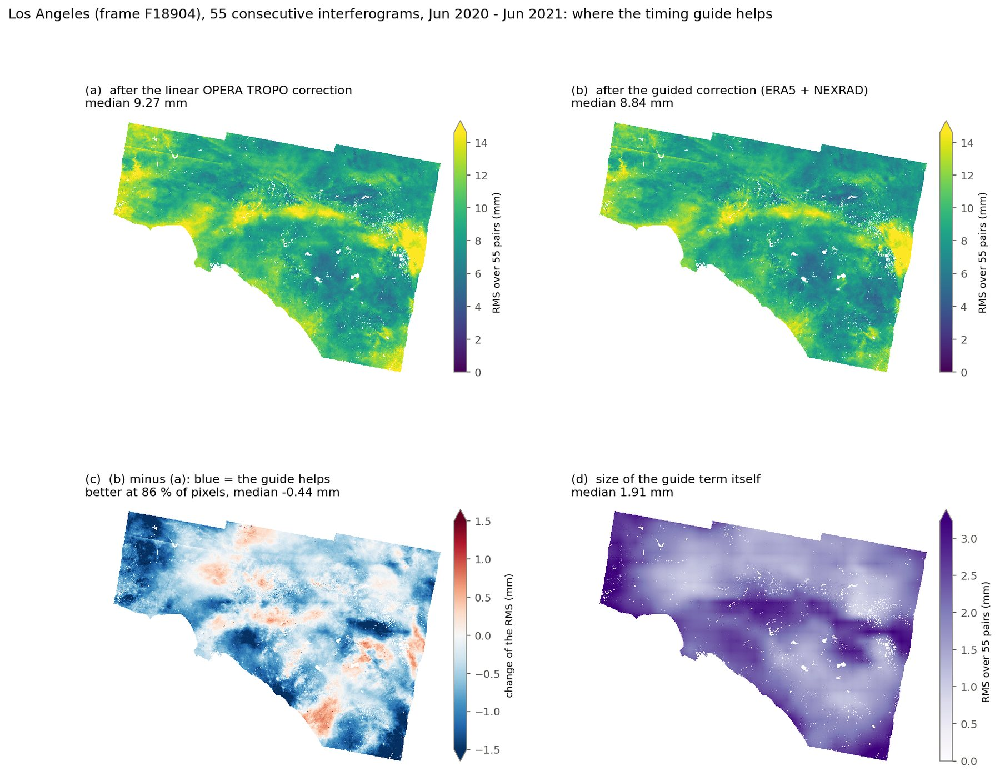

# Guided time interpolation of the tropospheric wet delay (ERA5 + NEXRAD)

OPERA L4 TROPO-ZENITH products exist every 6 hours, and `crop_tropo` interpolates the
two products bracketing each SAR acquisition. By default it does so linearly, which
assumes the wet delay changed along a straight line over those 6 hours. This page
describes an optional alternative that corrects the straight line with two sources that
see the weather in between: hourly ERA5 column water vapour and, over the contiguous US,
NEXRAD radar. It sits next to the other options:

| `time_interpolation` | What it does | Extra inputs |
|---|---|---|
| `"linear"` (default) | Blends the two products pixel by pixel | none |
| `"motion"` | Moves the wet delay along the motion tracked between the two products | none |
| `"guided"` | Corrects the straight line with hourly ERA5 and NEXRAD | ERA5, optionally NEXRAD |

The GNSS-guided correction (`apply_tropo(gnss_ztd_file=...)`) is a different kind of
option: it corrects where the model puts the moisture, not its timing, and can be
combined with any of the three.

## Usage

```bash
# 1. inputs: hourly ERA5 (needs cdsapi + ~/.cdsapirc) and NEXRAD n0q composites (public)
opera-utils tropo-guide-download --datetimes 2020-10-26T13:52:36 \
    --aoi-bounds -119.4 32.9 -116.2 34.9 --output-dir tropo_guide

# 2. crop and interpolate with the guide
opera-utils tropo-crop --tropo-urls-file tropo_urls.txt --datetimes 2020-10-26T13:52:36 \
    --aoi-bounds -119.4 32.9 -116.2 34.9 --time-interpolation guided \
    --era5-file tropo_guide/era5 --nexrad-dir tropo_guide/nexrad
```

```python
from opera_utils.tropo import crop_tropo, download_guide_inputs

download_guide_inputs(times, aoi_bounds, output_dir="tropo_guide")
crop_tropo(
    tropo_urls_file="tropo_urls.txt",
    datetimes=times,
    aoi_bounds=aoi_bounds,
    time_interpolation="guided",     # default: "linear"
    era5_file="tropo_guide/era5",    # required for "guided"
    nexrad_dir="tropo_guide/nexrad", # optional; without it only ERA5 is used
)
```

The output files have the same layout as before. `total_delay` carries the attributes
`time_interpolation="guided"`, `guide_sources` (`"ERA5 + NEXRAD"` or `"ERA5"`) and the
three weights used. Without NEXRAD, or when any composite for a date is missing, the
ERA5 term alone is used with its own weight. Outside the contiguous US there is no
NEXRAD, and ERA5 alone gives roughly 60 % of the gain.

## How it works

The wet delay at the acquisition time `t`, between products at `t0` and `t1`
(`w = (t - t0) / (t1 - t0)`), is

```
wet = wet_lin
    + 0.411 * rho * wet_lin                       # ERA5
    + 0.0156 m * dcover * wet_lin / wet_lin(0 m)  # NEXRAD echo cover
    + 0.157 * (wet_moved - wet_lin)               # NEXRAD echo motion
```

* **ERA5.** `rho = E(t) / [(1 - w) E(t0) + w E(t1)] - 1`, the fraction by which hourly
  ERA5 total column water vapour departs from its own straight line. Only ERA5's change
  in time is used, so its own biases cancel.
* **Echo cover.** The fraction of each cell covered by echoes of 20 dBZ or more, smoothed
  over 40 km, compared with its own straight line. It is applied along the wet delay's own
  height profile, so at sea level it equals the fitted value.
* **Echo motion.** Radar echoes are tracked hour by hour through the interval with the
  same optical flow as the `"motion"` option. The summed displacement moves the TROPO wet
  delay field, which is then blended in with a small weight.

The hydrostatic delay is interpolated linearly in every mode. Tracking needs context
beyond the AOI, so, as for `"motion"`, a wider area (`motion_margin_deg`, default 5°) is
read and the output is trimmed.

## Where the weights come from, and what it gains

The three weights were fitted against 5-minute GNSS zenith delays at 323 stations on ten
dates over the contiguous US (60,382 station-times), predicting what linear interpolation
misses. They were then applied, unchanged, to four Sentinel-1 frames whose dates were
excluded from the fit.

| Frame | Minutes from a product | Against GNSS | Interferograms |
|---|---:|---:|---|
| Los Angeles, 13:52 UTC | 113 | **4.6 %** lower error, 88 % of dates better | 58 of 59 DISP-S1 products better, 6.3 % lower residual; consecutive pairs 5.0 % |
| Puget Sound, 14:20 UTC | 141 | 7.4 %, 74 % of dates | 1.4 % (only 7 % of the frame is coherent) |
| Puget Sound, 02:01 UTC | 122 | 4.2 %, 76 % of dates | 3.5 % |
| Houston, 12:23 UTC | 23 | 1.4 %, 67 % of dates | 1.5 %, 80 % of products better |

On the ten US dates themselves the combination lowered the interpolation error by 17 %,
against 14 % for ERA5 alone and 16 % for ERA5 with the TROPO-derived motion.



*(a) Gain against GNSS at four frames; ERA5 + NEXRAD is best nearly everywhere. (b) The
Los Angeles consecutive interferograms: almost all fall below the 1:1 line. (c) The guide
must be applied to both dates of an interferogram. (d) The gain grows with the time from
the product epoch, as a timing correction should.*



*A night storm, 31 Mar 2023, 09 UTC. Dots: what linear interpolation missed according to
GNSS. (a) Radar echoes and their tracked motion. (b) The echo-cover term. (c) The motion
term. (d) ERA5 and radar together.*



*Los Angeles, per-pixel residual over 55 consecutive interferograms before (a) and after
(b) the guide; (c) lower at 86 % of pixels; (d) the guide term itself is a smooth ~2 mm.*

## Limits

* **It corrects timing only.** Where the model puts the moisture in the wrong place,
  which is the larger error in many regions, the guide cannot help. That is what the
  GNSS-guided correction addresses where the network is dense.
* **The gain is modest and depends on the time from a product epoch:** negligible within
  half an hour, largest at 2 to 3 hours.
* **NEXRAD sees rain, not vapour.** Its weight is empirical. The displacement it tracks
  ignores moisture that is not raining.
* **The weights come from ten dates over the contiguous US** and have not been tested
  elsewhere.
* GOES total precipitable water was tested as a third input. It helped on the ten US
  dates but added nothing on the four frames, so it is not included.
