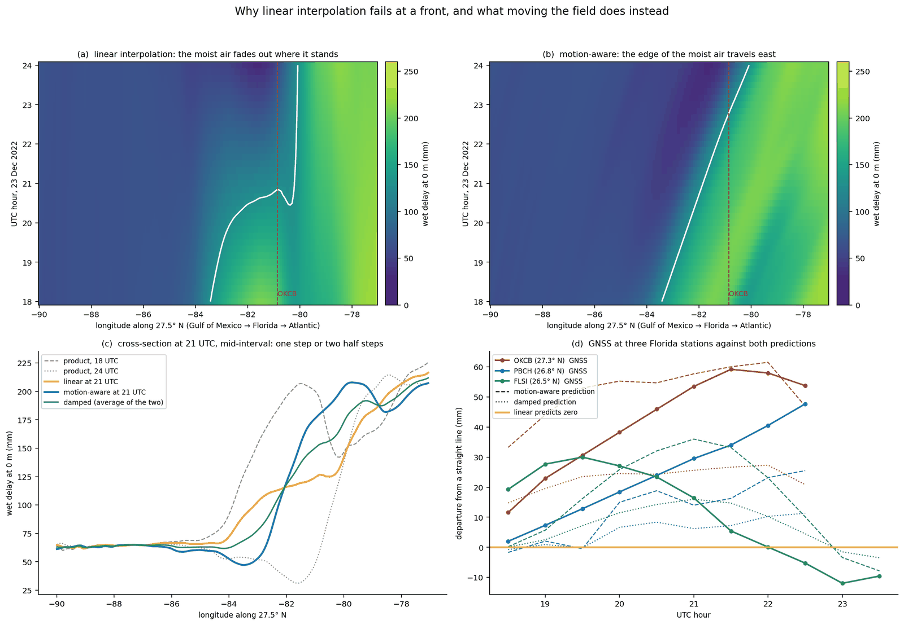
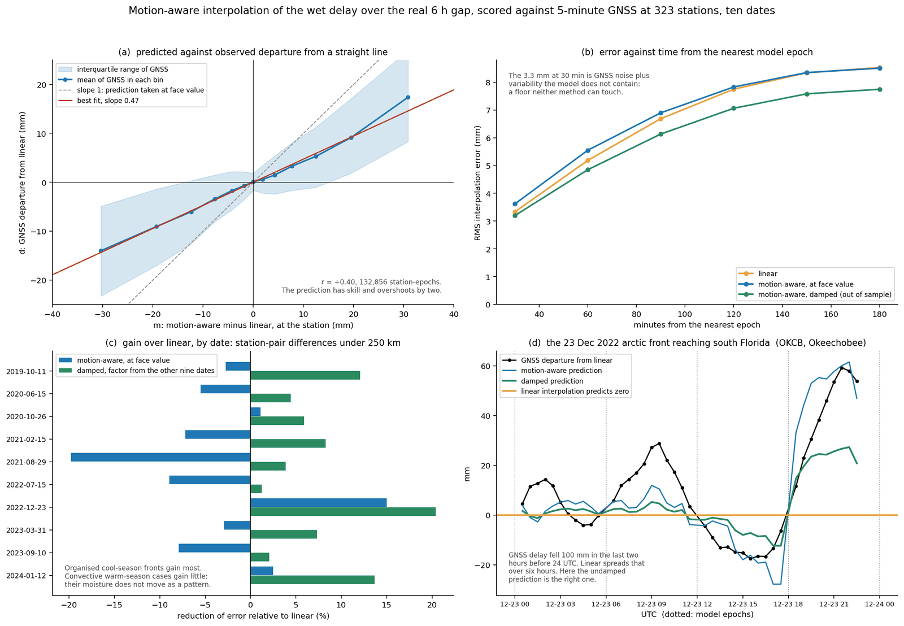
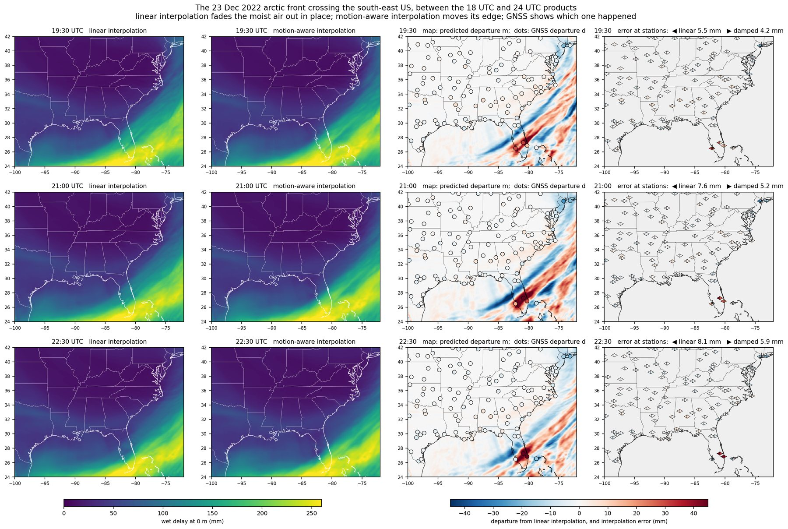
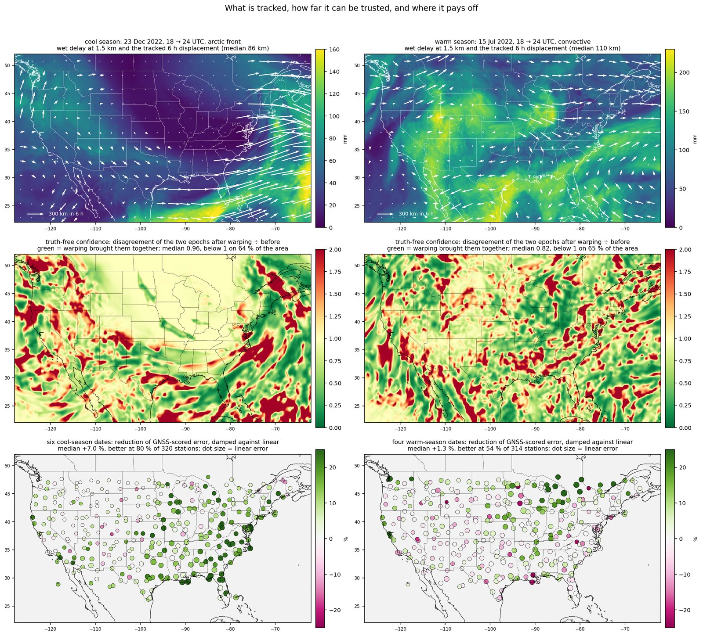
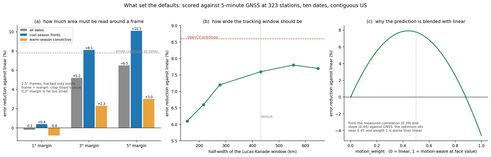

# Motion-aware time interpolation of the tropospheric wet delay

OPERA L4 TROPO-ZENITH products exist every 6 hours. A SAR acquisition is up to 3 hours
from the nearest one, and a weather front travels 100 to 300 km in that time.
`crop_tropo` interpolates the two bracketing products to the acquisition time. By
default it does so linearly. This page describes the optional alternative, what was
tested, and what was found.

## Usage

```python
from opera_utils.tropo import crop_tropo

crop_tropo(
    tropo_urls_file="tropo_urls.txt",
    datetimes=[acquisition_time],
    aoi_bounds=(-95.0, 34.0, -92.0, 36.0),
    time_interpolation="motion",   # default: "linear"
    motion_weight=0.5,             # 0 = linear, 1 = motion-aware at face value
    motion_margin_deg=5.0,         # extra area read to track the motion, then trimmed
)
```

```bash
opera-utils tropo-crop --tropo-urls-file tropo_urls.txt --datetimes 2022-12-23T21:00:00 \
    --aoi-bounds -95 34 -92 36 --time-interpolation motion
```

The output files have the same layout as before. `total_delay` carries the attributes
`time_interpolation`, `motion_weight` and `flow_height`. The building blocks
`estimate_flow`, `interpolate_motion` and `interp_in_time_motion` are importable from
`opera_utils.tropo` and need only numpy and scipy.

## Why linear interpolation fails at a front

Linear interpolation blends the two products pixel by pixel. A front that moved
between them is not moved: the moist air fades out where it was and fades in where it
will be, giving two half-amplitude steps instead of one full step in between.



*The 23 Dec 2022 arctic front crossing Florida, between the 18 and 24 UTC products.
(a, b) Wet delay along 27.5° N against time: under linear interpolation the edge of
the moist air jumps, under motion-aware interpolation it travels. (c) Cross-section
at mid-interval. (d) GNSS at three Florida stations against both predictions.*

## How it works

1. Take the wet delay of the two products at one fixed height level (1500 m). At a
   fixed height there is no terrain imprint, so nothing static has to be removed.
2. Estimate a dense displacement field between them, in both directions, with
   coarse-to-fine iterative Lucas-Kanade optical flow on ~0.56° pixels.
3. For a time a fraction `w` through the interval, move the first product forward by
   `w` of the displacement, the second backward by `1 - w`, and blend them with
   weights `1 - w` and `w`. The warps fix position, the blend handles growth and decay.
4. Apply the same displacement to every height level of the wet delay cube. The
   hydrostatic delay is interpolated linearly.
5. Blend the result with plain linear interpolation through `motion_weight`.

## Tests and findings

**Data.** Ten dates over the contiguous US, 2019 to 2024: strong cold fronts, a
hurricane landfall, quiet controls. Wet delay read from the published products.
Truth: 5-minute GNSS zenith delays from the Nevada Geodetic Laboratory at 323
stations, 1.74 million samples. Between two products GNSS departs from a straight
line by `d`; linear interpolation predicts zero, the motion-aware method predicts `m`.
The interpolation error is `d` for linear and `d - m` for motion-aware. Working with
departures cancels the model bias at the two epochs and the hydrostatic delay to
first order.



| | point error | station pairs < 250 km |
|---|---:|---:|
| linear | 6.72 mm | 8.71 mm |
| motion-aware, weight 1 | 6.86 mm | 9.28 mm |
| motion-aware, weight ~0.5 (fitted out of sample) | **6.16 mm** | **8.16 mm** |

1. **At face value the method does not beat linear interpolation.** Its prediction
   correlates with GNSS (r = +0.40) but overshoots by about two.
2. **Blended half and half with linear it helps on every one of the ten dates**: 8.4 %
   lower point error, 6.4 % lower station-pair error. The weight was fitted on the
   other nine dates each time and stayed between 0.44 and 0.50.
3. **The weather regime decides the gain.** Cool-season organised fronts: 13 % and
   11 %, better at 80 % of stations. Warm-season convective cases: 4 % and 3 %, better
   at 54 % of stations. The 23 Dec 2022 arctic front: 23 % and 20 %.
4. **There is a floor of about 3.3 mm** from GNSS noise and variability the model does
   not contain. Linear error grows from there to 8.5 mm at mid-interval.
5. **One motion field for the whole column is as good as one per level.**



*Three times inside one 6 h interval. Third column: the predicted departure from
linear interpolation as a map, with the GNSS departure as dots on the same colour
scale. Fourth column: the error left at each station, linear (◀) and blended (▶).*

### Why summer cases gain against the model and lose against GNSS

A leave-one-out test on the products themselves (predict the 06 UTC product from 00 and
12 UTC) showed gains of 12 to 14 % on summer dates. Against GNSS the same dates lose at
face value. The two tests ask different questions.

* **Against the model** the question is whether the model's own middle field is
  reproduced. The model's moisture features are carried by the model's own wind, so
  tracking them works, whatever they are.
* **Against GNSS** the question is whether the result is closer to the real
  atmosphere. In convective weather the model does not have individual cells in the
  right place, and cells live one to three hours, less than the 6 h between products.
  The features in the two products are then often different cells, and optical flow
  matches unrelated ones.
* **A sharp feature in the wrong place is penalised twice**: once where it was put and
  once where it really is. Linear interpolation blurs the feature, which is the better
  guess when the position is uncertain.
* Part of the summer change between two products is growth in place, driven by the
  diurnal cycle. Optical flow can only explain change as motion.

The measured best-fit slope of GNSS on the prediction shows this directly: 0.57 to 0.70
on cool-season dates, 0.30 to 0.38 on warm-season ones. This is also why the default
`motion_weight` is 0.5 and not 1.



*Top: tracked 6 h displacement for a winter and a summer case. Middle: a confidence map
that needs no truth, the disagreement between the two products after warping divided by
before; one coherent band along the winter front, a patchwork in summer. Bottom:
GNSS-scored gain station by station.*

### What set the defaults



* **`motion_margin_deg = 5`.** Emulating 2.5° frames tracked only inside frame plus
  margin: a 1° margin gives no gain, 3° gives 5.2 %, 5° gives 6.5 %, the whole continent
  7.8 %. A front arriving in the frame has to be visible upstream in the earlier product.
* **Tracking window.** Skill rises with the window size and levels off near a
  half-width of 400 to 550 km. The scipy implementation reaches 7.8 % against 8.6 %
  for an OpenCV prototype, without adding a dependency.
* **`motion_weight = 0.5`.** From the measured correlation and slope the optimum is
  near 0.45, and weight 1 is worse than linear.

## Limits

* Ten hand-picked dates over one region. Not a climatology.
* GNSS zenith delay averages over a cone of sky and is smoothed in time by the
  processing filter, which lowers the fitted slope. The best weight for an
  instantaneous SAR acquisition may be higher than 0.5.
* No interferogram has been corrected with it yet.
* Displacements beyond about 500 km in 6 h are outside the tracker's range.
* Most of the residual wet delay error is variability that no global weather model
  contains. This option addresses the timing of resolved features only.
